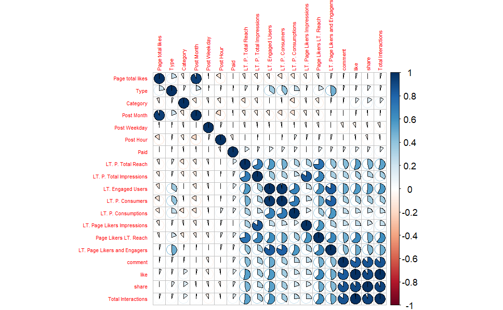
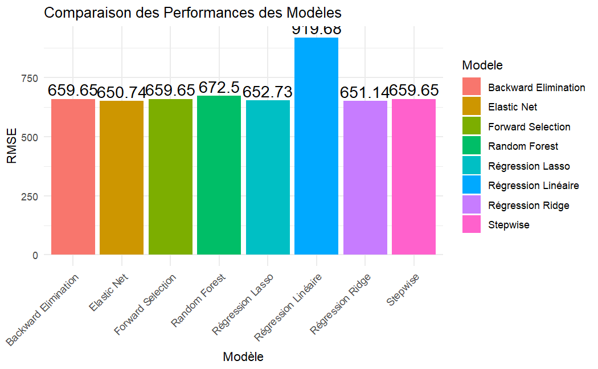

# Social Media Performance Prediction

## Overview
This project aims to predict key performance metrics (e.g., reach, engagement) for social media posts on Facebook using a cosmetics brand dataset containing 500 posts and 19 variables. We focus on predicting **Lifetime Engaged Users** as the primary target metric to measure content impact.

## Key Features
- **Input Variables**: Post type, publication time, page likes, paid status
- **Target Metrics**: Engagement, reach, impressions, and derived interactions
- **Methods**: Linear regression, penalized regressions (Ridge/Lasso/Elastic Net), and Random Forest
  

## Data Preprocessing
- Removed rows with missing values
- Converted categorical features to numeric
- Normalized data for model consistency

## Key Insights from EDA
1. **Post Type Impact**: 
   - Photos drove **347K engagements** (58% of total), making them the most effective content type.
   - Videos and links underperformed (<5% combined).

2. **Temporal Patterns**:
   - Peak engagement in **July** (59K users) and October (49K users)
   - Lowest engagement in November (24K users)

3. **Page Likes Correlation**:
   - Weak positive correlation with engagement (R²=0.19)
   - High likes ≠ guaranteed engagement

4. **Paid Content**:
   - 5% impact on engagement metrics

## Model Performance
| Model                | RMSE   |
|----------------------|--------|
| Elastic Net          | 650.74 |
| Ridge Regression     | 651.14 |
| Lasso Regression     | 652.73 |
| Random Forest        | 672.5 |
| Linear Regression    | 919.68 |

**Best Performer**: Elastic Net (Combined L1/L2 regularization)

## How to Reproduce
This specific cosmetics brand dataset isn't publicly available due to confidentiality agreements.

## Contributors

- Ahmed TRAORE
- Winner KAH

